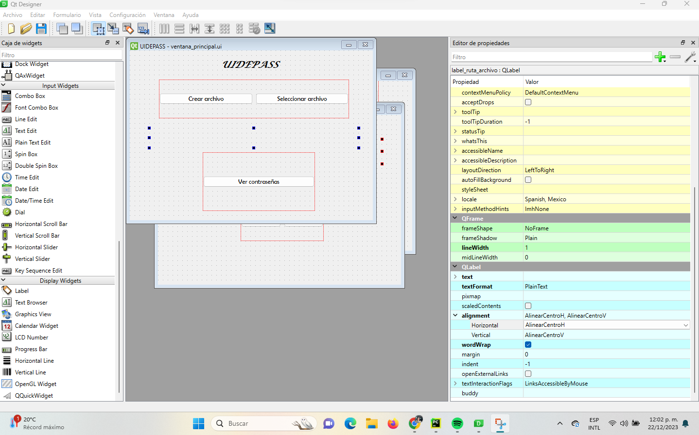

# uidepass

## Prerequisitos

- Instalar librerías PyQt6 y PyQt6-tools
  - `pip install pyqt6`
  - `pip install pyqt6-tools`
- Instalar python **3.9.x**

## Construcción de pantallas
Para construir las pantallas con PyQt se utilizó la herrramienta designer que se puede utilizar con el siguiente comando
`pyqt6-tools.exe designer`

En esta herramienta se genero todo el diseño de las pantallas y se guardaron en archivos con extensión .ui
y para convertirlas en .py se utilizo el siguiente comando
`pyuic6.exe -o .\app\views\qt\ui_ventana_principal.py .\app\views\qt\designer\ventana_principal.ui`
Este comando nos convierte todo el diseño realizado en código python

## Ejecución

Para ejecutar el programa uidepass se debe utilizar el siguiente comando

`python ./app/main.py`

